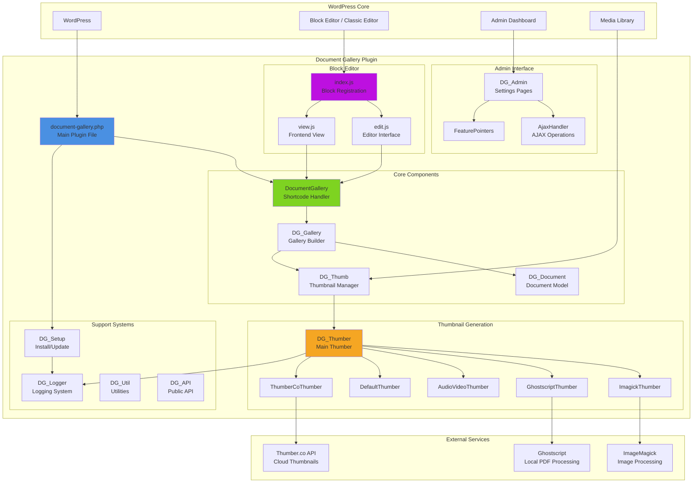
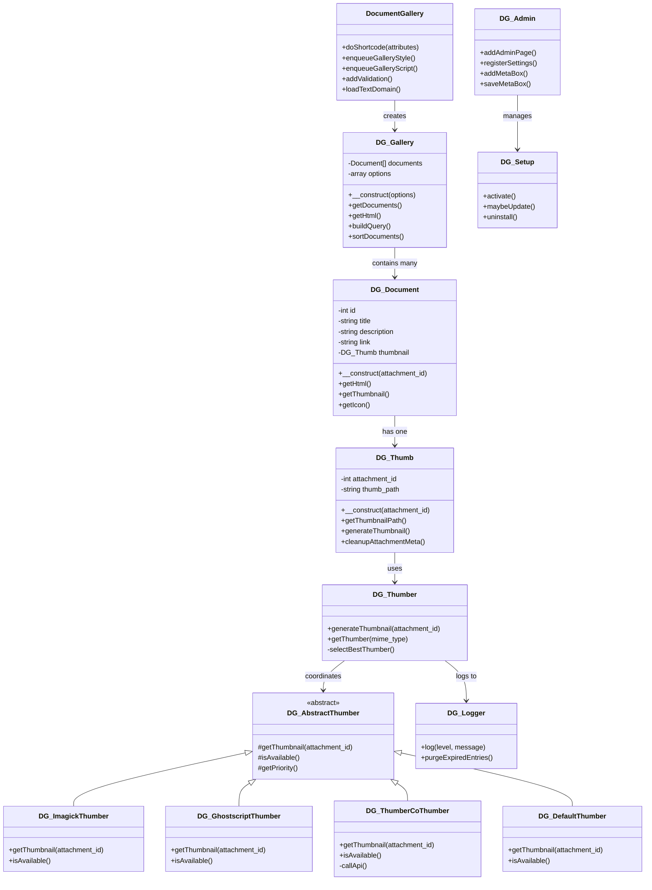
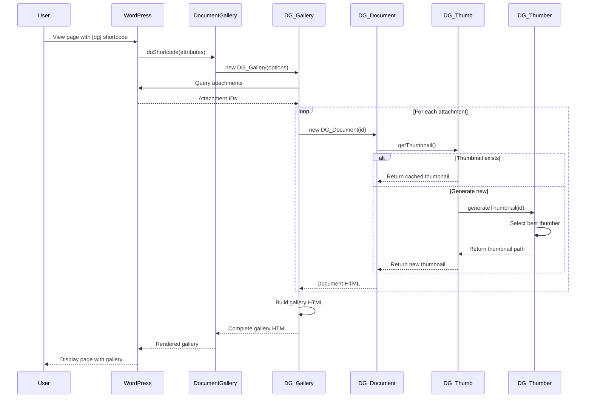
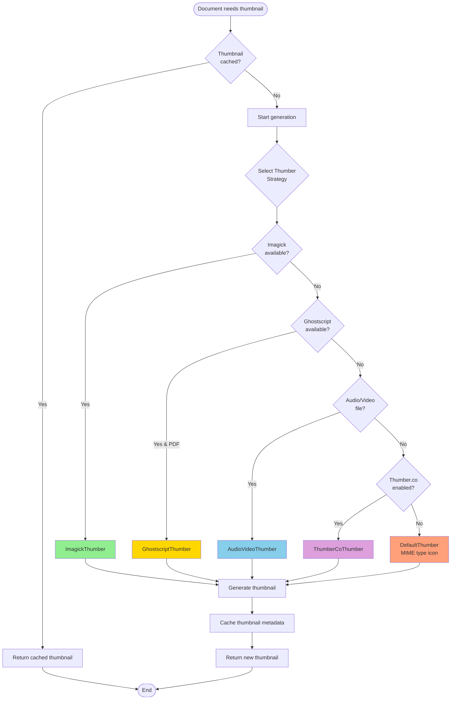
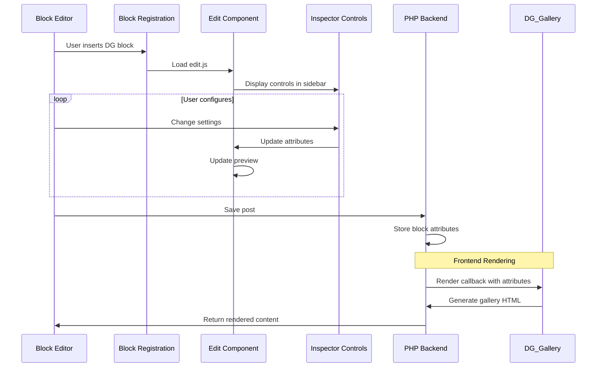

# Document Gallery - Codebase Architecture

> A comprehensive visual summary of the Document Gallery WordPress plugin architecture

## 📊 Overview

Document Gallery is a WordPress plugin that generates thumbnails for documents (PDFs, Word docs, PowerPoint, etc.) and displays them in a gallery-like format. The plugin supports both WordPress Block Editor (Gutenberg) and classic shortcode usage.

**Version:** 5.1.0  
**Language:** PHP (Backend), JavaScript (Frontend/Block Editor)  
**Total Lines of Code:** ~9,941 (excluding minified files and node_modules)

---

## 🏗️ High-Level Architecture



---

## 📁 Directory Structure

```
document-gallery/
├── 📄 document-gallery.php          # Main plugin file (entry point)
├── 📄 README.txt                    # WordPress.org readme
├── 📄 CHANGELOG.md                  # Version history
├── 📄 package.json                  # Node.js dependencies
│
├── 📁 src/                          # Source code
│   ├── 📁 inc/                      # Core PHP classes
│   │   ├── class-document-gallery.php      # Main plugin class
│   │   ├── class-gallery.php               # Gallery builder
│   │   ├── class-document.php              # Document model
│   │   ├── class-thumb.php                 # Thumbnail operations
│   │   ├── class-thumber.php               # Thumbnail generation coordinator
│   │   ├── class-setup.php                 # Installation/updates
│   │   ├── class-logger.php                # Logging system
│   │   ├── class-util.php                  # Utility functions
│   │   ├── class-api.php                   # Public API for developers
│   │   ├── class-gallery-sanitization.php  # Input validation
│   │   ├── class-image-editor-imagick.php  # ImageMagick integration
│   │   │
│   │   └── 📁 thumbers/             # Thumbnail generation strategies
│   │       ├── class-abstract-thumber.php      # Base class
│   │       ├── class-imagick-thumber.php       # ImageMagick implementation
│   │       ├── class-ghostscript-thumber.php   # Ghostscript PDF processing
│   │       ├── class-audio-video-thumber.php   # Media file thumbnails
│   │       ├── class-default-thumber.php       # Fallback/default icons
│   │       ├── class-thumber-co-thumber.php    # Cloud service integration
│   │       └── 📁 thumber-co/       # Thumber.co API client
│   │
│   ├── 📁 admin/                    # Admin interface
│   │   ├── class-admin.php                 # Settings pages
│   │   ├── class-ajax-handler.php          # AJAX endpoints
│   │   ├── class-feature-pointers.php      # WordPress pointers
│   │   ├── media-manager-template.php      # Media manager UI
│   │   └── 📁 tabs/                 # Settings page tabs
│   │       ├── general-tab.php
│   │       ├── thumbnail-management-tab.php
│   │       ├── advanced-tab.php
│   │       ├── logging-tab.php
│   │       └── thumber-co-tab.php
│   │
│   ├── 📁 block/                    # Gutenberg Block Editor
│   │   ├── block.json              # Block metadata
│   │   ├── index.js                # Block registration
│   │   ├── edit.js                 # Editor component (196 lines)
│   │   ├── view.js                 # Frontend component (2 lines)
│   │   ├── editor.scss             # Editor styles
│   │   └── style.scss              # Frontend styles
│   │
│   └── 📁 assets/                   # Static assets
│       ├── 📁 css/
│       │   ├── style.css           # Gallery frontend styles
│       │   ├── style.min.css
│       │   ├── admin.css           # Admin interface styles (837 lines)
│       │   └── admin.min.css
│       ├── 📁 js/
│       │   ├── gallery.js          # Frontend gallery interactions (169 lines)
│       │   ├── admin.js            # Admin interface JS (414 lines)
│       │   ├── media_manager.js    # Media manager integration (565 lines)
│       │   └── *.min.js            # Minified versions
│       └── 📁 icons/                # Document type icons
│
├── 📁 build/                        # Compiled Block Editor assets
│   └── 📁 block/
│       ├── index.js                # Compiled block code
│       ├── index.css               # Compiled styles
│       └── *.asset.php             # WordPress asset dependencies
│
├── 📁 languages/                    # Internationalization
│   └── *.po, *.mo                  # Translation files (ES, FR, RU, UK, SV, FI)
│
├── 📁 scripts/                      # Build scripts
│   └── check-version.js            # Version consistency checker
│
└── 📁 log/                          # Runtime logs (if enabled)
```

---

## 🔄 Component Relationships



---

## 🎯 Key Components & Responsibilities

### Core Classes (src/inc/)

| Class | Lines | Purpose |
|-------|-------|---------|
| **DocumentGallery** | 208 | Main plugin class, handles shortcode registration and rendering |
| **DG_Gallery** | 554 | Builds gallery HTML, manages document queries and sorting |
| **DG_Document** | 174 | Represents a single document with metadata and thumbnail |
| **DG_Thumb** | 421 | Manages thumbnail metadata and file operations |
| **DG_Thumber** | 323 | Coordinates thumbnail generation across different engines |
| **DG_Setup** | 548 | Handles plugin activation, updates, and uninstallation |
| **DG_Logger** | 359 | Logging system with multiple log levels and automatic purging |
| **DG_Util** | 187 | Utility functions for MIME types, file operations, etc. |
| **DG_API** | 75 | Public API for developers to extend functionality |
| **DG_GallerySanitization** | 513 | Validates and sanitizes gallery options and user input |

### Thumbnail Generation (src/inc/thumbers/)

The plugin uses a **strategy pattern** for thumbnail generation with multiple implementations:

| Thumber | Lines | Purpose | Priority |
|---------|-------|---------|----------|
| **DG_ImagickThumber** | 102 | Uses ImageMagick/Imagick PHP extension | High |
| **DG_GhostscriptThumber** | 157 | Uses Ghostscript for PDF processing | Medium |
| **DG_AudioVideoThumber** | 87 | Extracts frames from video/audio files | Medium |
| **DG_ThumberCoThumber** | 182 | Cloud-based thumbnail service (thumber.co) | Low |
| **DG_DefaultThumber** | 152 | Fallback icons based on MIME type | Lowest |

### Admin Interface (src/admin/)

| Class | Lines | Purpose |
|-------|-------|---------|
| **DG_Admin** | 552 | Main admin interface, settings pages |
| **DG_AjaxHandler** | 74 | Processes AJAX requests (thumbnail upload, regeneration) |
| **DG_FeaturePointers** | 167 | WordPress admin pointers for new features |
| **General Tab** | 374 | Default gallery display options |
| **Thumbnail Management Tab** | 329 | Thumbnail generation settings |
| **Advanced Tab** | 124 | Advanced configuration options |
| **Logging Tab** | 127 | Logging configuration and viewer |
| **Thumber.co Tab** | 130 | Cloud service integration settings |

### Block Editor (src/block/)

| File | Lines | Purpose |
|------|-------|---------|
| **index.js** | 33 | Registers the Document Gallery block |
| **edit.js** | 196 | Block editor interface with InspectorControls |
| **view.js** | 2 | Frontend view component (minimal, uses PHP rendering) |
| **block.json** | - | Block metadata and attributes definition |

---

## 🔄 Data Flow Diagrams

### Gallery Rendering Flow



### Thumbnail Generation Flow



### Block Editor Integration



---

## 🔌 WordPress Integration Points

### Hooks & Filters

The plugin registers numerous WordPress hooks:

#### Actions
```php
// Core initialization
add_action('init', 'document_gallery_block_init')
add_action('init', [DocumentGallery, 'addValidation'])
add_action('plugins_loaded', [DocumentGallery, 'loadTextDomain'])

// Admin
add_action('admin_menu', [DG_Admin, 'addAdminPage'])
add_action('admin_init', [DG_Admin, 'registerSettings'])
add_action('add_meta_boxes', [DG_Admin, 'addMetaBox'])

// AJAX
add_action('wp_ajax_dg_upload_thumb', [DG_Admin, 'saveMetaBox'])

// Cleanup
add_action('delete_attachment', [DG_Thumb, 'cleanupAttachmentMeta'])
add_action(DG_Logger::PurgeLogsAction, [DG_Logger, 'purgeExpiredEntries'])

// Frontend
add_action('wp_enqueue_scripts', [DocumentGallery, 'enqueueGalleryStyle'])
add_action('wp_enqueue_scripts', [DocumentGallery, 'enqueueGalleryScript'])
add_action('wp_print_scripts', [DocumentGallery, 'printCustomStyle'])

// Block Editor
add_action('enqueue_block_editor_assets', 'document_gallery_block_localize')
```

#### Filters
```php
add_filter('plugin_action_links_' . DG_BASENAME, [DG_Admin, 'addSettingsLink'])
add_filter('plugin_row_meta', [DG_Admin, 'addDonateLink'])
add_filter('dg_use_default_gallery_style', '__return_true')

// Developer API filters (defined in DG_API)
apply_filters('dg_gallery_query', $args)
apply_filters('dg_gallery_html', $html, $documents)
apply_filters('dg_document_html', $html, $document)
apply_filters('dg_icon_template', $template)
// ... and many more
```

#### Shortcodes
```php
add_shortcode('dg', [DocumentGallery, 'doShortcode'])
```

---

## 📊 Code Statistics

### Language Distribution
```
PHP:        7,587 lines (76%)
JavaScript: 1,439 lines (14%)
CSS:        915 lines (9%)
Total:      9,941 lines
```

### File Size Distribution (non-minified)
| File | Lines | Purpose |
|------|-------|---------|
| class-gallery.php | 554 | Largest core class |
| class-setup.php | 548 | Second largest |
| class-gallery-sanitization.php | 513 | Input validation |
| admin.css | 837 | Largest stylesheet |
| media_manager.js | 565 | Largest JS file |

### Complexity Hotspots
1. **DG_Gallery** - Complex query building and HTML generation
2. **DG_GallerySanitization** - Extensive input validation rules
3. **DG_Setup** - Multi-version upgrade paths
4. **DG_Thumber** - Strategy selection and coordination

---

## 🎨 Features Overview

### Gallery Display Options
- **Layouts**: Grid or list view
- **Columns**: Configurable column count (1-10)
- **Sorting**: By title, date, author, menu order
- **Filtering**: By document type, category, date range
- **Pagination**: Optional pagination for large galleries
- **Links**: Open in new tab, same tab, or no link

### Thumbnail Generation Methods
1. **ImageMagick/Imagick** (Preferred)
2. **Ghostscript** (PDF fallback)
3. **Video Frame Extraction** (Media files)
4. **Thumber.co API** (Cloud service)
5. **MIME Type Icons** (Ultimate fallback)

### Supported File Types
- **Documents**: PDF, DOC, DOCX, XLS, XLSX, PPT, PPTX
- **Images**: JPG, PNG, GIF, WebP, AVIF
- **Media**: MP3, MP4, AVI, MOV
- **Archives**: ZIP, RAR
- **And many more** (via Thumber.co)

---

## 🔐 Security Features

1. **Input Sanitization** - Comprehensive validation via `DG_GallerySanitization`
2. **Nonce Verification** - All AJAX requests validated
3. **Capability Checks** - Admin operations require proper permissions
4. **Path Validation** - File operations use WordPress functions
5. **SQL Injection Prevention** - Uses WordPress DB API
6. **XSS Prevention** - Output escaping throughout

---

## 🌍 Internationalization

Fully translatable with support for:
- Spanish (es_ES)
- French (fr_FR)
- Russian (ru_RU)
- Ukrainian (uk)
- Swedish (sv_SE)
- Finnish (fi)

Translation files located in `/languages/` directory.

---

## 🔧 Developer API

The plugin provides extensive customization hooks:

```php
// Modify gallery query
add_filter('dg_gallery_query', function($args) {
    // Customize WP_Query arguments
    return $args;
});

// Customize gallery HTML
add_filter('dg_gallery_html', function($html, $documents) {
    // Modify complete gallery output
    return $html;
}, 10, 2);

// Customize document HTML
add_filter('dg_document_html', function($html, $document) {
    // Modify individual document display
    return $html;
}, 10, 2);

// Customize icon template
add_filter('dg_icon_template', function($template) {
    // Modify icon HTML template
    return $template;
});
```

---

## 🚀 Build & Deployment

### Build Process
```bash
npm run build
```

This executes:
1. `check-version` - Validates version consistency across files
2. `wp-scripts build` - Compiles Block Editor assets
3. `minify` - Minifies CSS and JS files

### Build Tools
- **@wordpress/scripts** - WordPress official build tools
- **terser** - JavaScript minification
- **csso-cli** - CSS minification

### Output
Compiled assets go to `/build/block/`:
- `index.js` - Block registration code
- `index.css` - Block editor styles
- `style-index.css` - Frontend styles
- `*.asset.php` - Dependency manifests

---

## 📈 Performance Considerations

1. **Thumbnail Caching** - Generated thumbnails cached in WordPress media library
2. **Lazy Loading** - Frontend JavaScript enables lazy loading for large galleries
3. **Query Optimization** - Efficient WP_Query with proper caching
4. **Asset Minification** - All CSS/JS assets minified in production
5. **Conditional Loading** - Admin assets only load in admin, frontend assets only on pages with galleries

---

## 🧪 Testing Strategy

While no automated test suite exists in the repository, the plugin follows these quality practices:

1. **PHP Version Compatibility Check** - Requires PHP 5.6+
2. **WordPress Version Check** - Requires WP 6.1+
3. **Graceful Degradation** - Falls back through thumbnail generation methods
4. **Error Logging** - Comprehensive logging system for debugging
5. **Version Consistency** - Automated version checking via `check-version.js`

---

## 📝 Configuration Storage

Plugin settings stored in WordPress options table:
- **Option Name**: `document_gallery`
- **Structure**: Nested array with sections:
  - `gallery` - Default gallery options
  - `thumber` - Thumbnail generation settings
  - `logging` - Logging configuration
  - `thumber_co` - Cloud service credentials

---

## 🎯 Summary

Document Gallery is a well-architected WordPress plugin that:

✅ **Separates concerns** - Clear separation between core logic, admin, and frontend  
✅ **Uses design patterns** - Strategy pattern for thumbnail generation  
✅ **Follows WordPress standards** - Proper use of hooks, filters, and APIs  
✅ **Maintains backwards compatibility** - Supports both Block Editor and classic shortcode  
✅ **Prioritizes extensibility** - Rich developer API with numerous hooks  
✅ **Handles errors gracefully** - Fallback strategies and comprehensive logging  
✅ **Supports internationalization** - Full translation support  
✅ **Ensures security** - Input sanitization and capability checks throughout  

The codebase demonstrates mature WordPress plugin development practices with clear architecture, good documentation, and extensive configurability.
